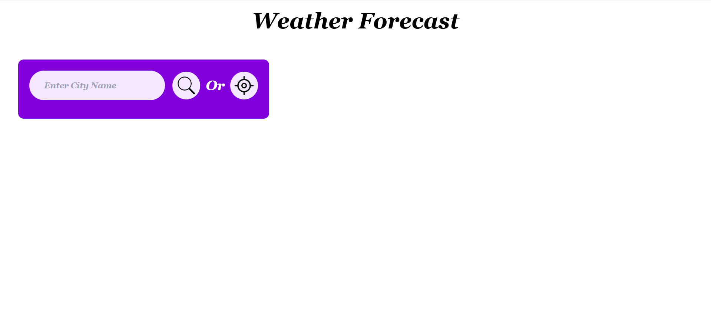
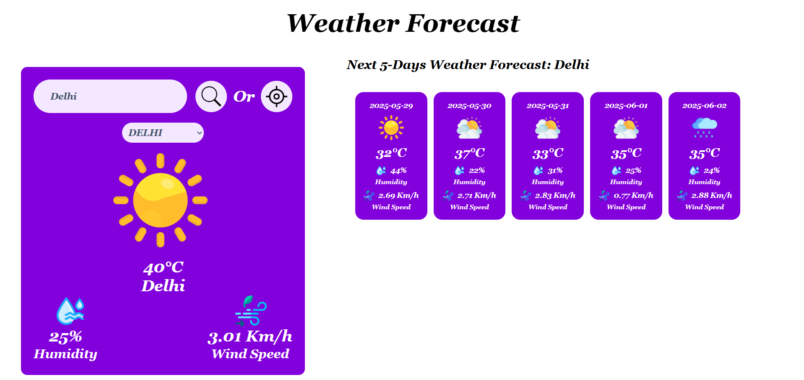
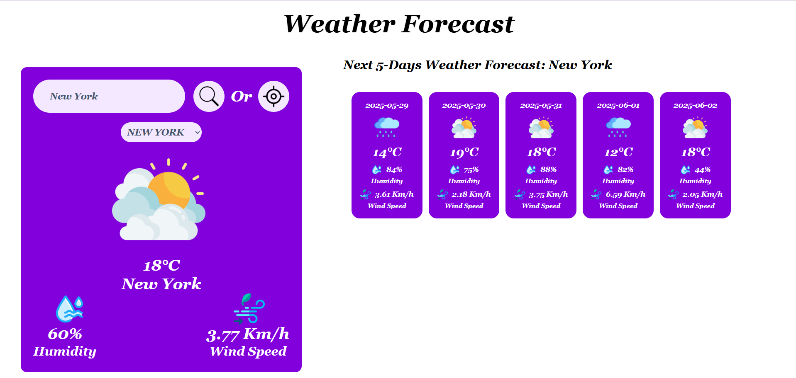

# Weather Forecast Application

A responsive web application that provides current weather and 5-day forecast details for any city or the user's current location. Built using **JavaScript**, **HTML**, **Tailwind CSS**, and the **OpenWeatherMap API**.

---

## Screenshots

- Homepage
  
- Search Result
  
- Search Result from other City
  

## Features

- Search weather by **city name**
- Get weather of **current location** using Geolocation API
- View **5-day extended forecast**
- Display of temperature, humidity, wind speed, and weather icons
- **Recent search history** dropdown (stored in browser's localStorage)
- Graceful error handling for invalid inputs or API issues
- Fully **responsive design** for desktop, tablet, and mobile devices

---

## Technologies Used

- HTML5
- Tailwind CSS
- JavaScript (ES6)
- OpenWeatherMap API
- LocalStorage API
- Geolocation API

---

## Getting Started

### Clone the repository

```bash
git clone https://github.com/your-username/weather-forecast-app.git
cd weather-forecast-app

npm run dev  //This command watches changes in src/input.css and compiles them to output.css using Tailwind CLI.

//Once Tailwind watches is running then open it with live server.

```
